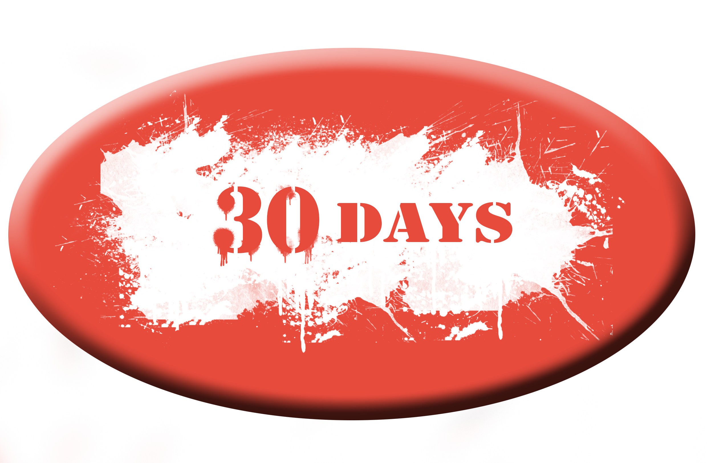

  

<h1 align="center">
  30 Days Challenge
</h1>

## Deployed app
	
Check out the app [here](https://thirtydaysapp.com/).

## Description

30 Days Challenge is A place to create workouts and join others on their challenges - sharing progress as you go

To use the app,
- Visit the link above
- Login with Instagram or google
- It will sign in with your account details
- Click Browse workouts to find challenges available for you to join
- Click on Join workout to join the challenge and see more details
- Click Ongoing workouts to scroll through your joined challenges
- Click on view workout to be able to see more details about each challenge 
- Click on timeline to see What your friends are up to and how they are doing with their challenges

## Technologies
- [Passport](http://www.passportjs.org/)
- [GoogleStrategy](http://www.passportjs.org/packages/passport-google-oauth2/)
- [Mongo](https://www.mongodb.com/)
- [Express](https://expressjs.com/)
- [Node.js](https://nodejs.org/en/)
- [Mongoose](https://mongoosejs.com/docs/)
- [Morgan](https://www.loggly.com/docs/node-express-js-morgan-logging/)
- [Bootstrap](https://getbootstrap.com/)
- [path](https://nodejs.org/api/path.html)
- [jQuery](https://jquery.com/)
- [Cookies](https://www.npmjs.com/package/cookies)
- [React] (https://reactjs.org/)
- [axios](https://github.com/axios/axios)
- [Docker](https://www.docker.com/)

### Installing
 
If you would like to run the application locally:
- Clone this repository to your local machine with `git clone <repo-url>`.
- Install NPM dependencies by running `npm install` in the project directory.
- Install NPM dependencies by running `npm install` in the project client.
- Open `.env` and update the Instagram Client-ID and Instagram Client-Secret
- Open the terminal
- Run `Mongod`
- Ensure that you are in the root project directory, then run `npm start`.
- The application will be running at `localhost:3000/`

### Future features
- [ ] Create custom # of days for workout
- [ ] Send timeline updates to Instagram
- [ ] Add friends so you only see your network
- [ ] Mark your progress on a challenge each day that you complete
- [ ] Comment features to show someone your support 
